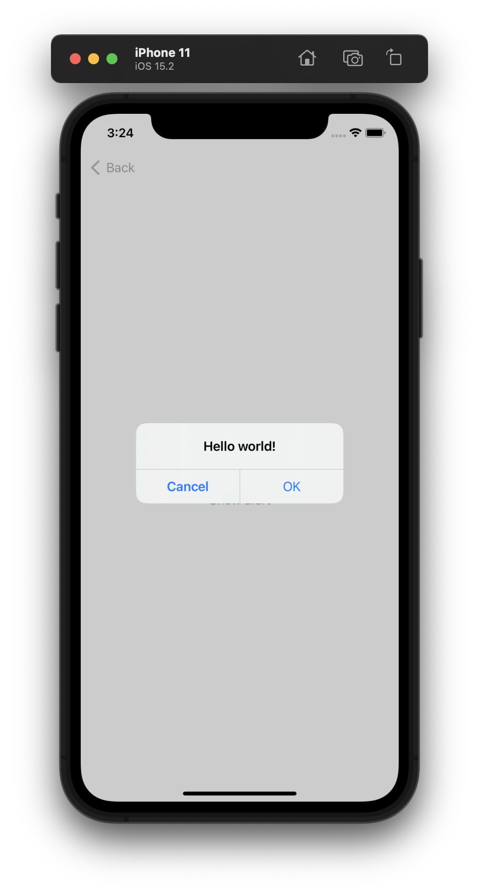
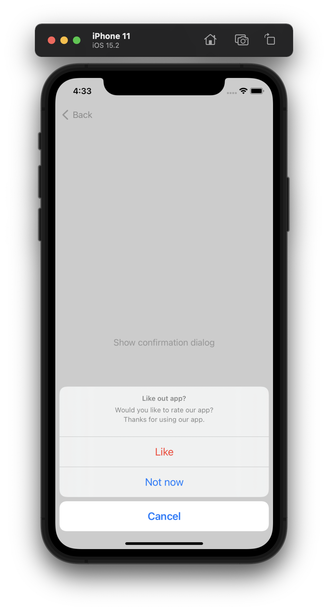

# Data driven alert and confirmation dialog
Based on [Composable Architecture](https://github.com/pointfreeco/swift-composable-architecture)

## AlertState
```swift
struct AlertHostView: View {
    @State var alertState: AlertState<AlertAction>?
    
    var body: some View {
        Button("Show alert") {
            alertState = .init(
                title: "Do you want to delete this account?",
                message: "You cannot undo this action",
                buttons: [
                    .cancel("Cancel", action: .send(.cancel)),
                    .destructive("Delete", action: .send(.delete))
                ]
            )
        }
        .alert(
            $alertState,
            send: { action in print(action) },
            dismiss: .dismiss
        )
    }
}
```



## ConfirmationDialogState
```swift
struct ConfirmationDialogHostView: View {
    @State var confirmationDialogState: ConfirmationDialogState<AlertAction>?
    
    var body: some View {
        Button("Show confirmation dialog") {
            confirmationDialogState = .init(
                title: "Like out app?",
                titleVisibility: .visible,
                message: "Would you like to rate our app?\nThanks for using our app.",
                buttons: [
                    .destructive("Like", action: .send(.like)),
                    .default("Not now", action: .send(.notNow)),
                    .cancel("Cancel", action: .send(.cancel))
                ]
            )
        }
        .confirmationDialog(
            $confirmationDialogState,
            send: { action in print(action) },
            dismiss: .dismiss
        )
    }
}
```

