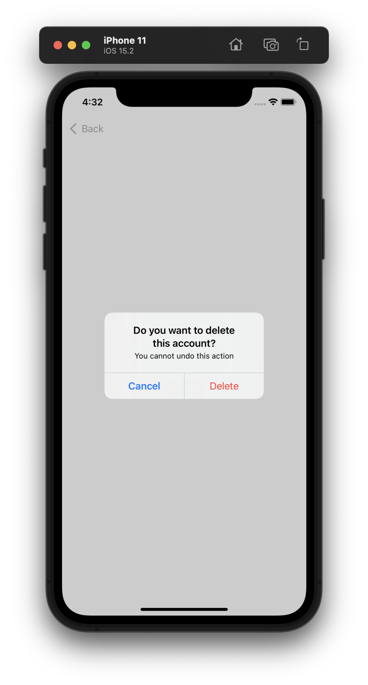

# Data driven alret and action sheet

## AlertState
```swift
struct SwiftUIAlertView: View {
    @State var alertState: AlertState<AlertAction>?
    
    var body: some View {
        Button("Show alert") {
            alertState = .init(
                title: "Hello world!",
                message: nil,
                buttons: [
                    .cancel("Cancel", action: .send(.cancel)),
                    .default("OK", action: .send(.ok))
                ]
            )
        }
        .alert(
            $alertState,
            send: { action in print(action) },
            dismiss: .dismiss
        )
    }
}
```



## ActionSheetState
```swift
struct SwiftUIActionSheetView: View {
    @State var actionSheetState: ActionSheetState<AlertAction>?
    
    var body: some View {
        Button("Show action sheet") {
            actionSheetState = .init(
                title: "Hello world!",
                message: nil,
                buttons: [
                    .default("OK", action: .send(.ok)),
                    .default("I am not sure", action: .send(.possible)),
                    .destructive("No no no", action: .send(.no)),
                    .cancel("Cancel", action: .send(.cancel))
                ]
            )
        }
        .actionSheet(
            $actionSheetState,
            send: { action in print(action) },
            dismiss: .dismiss
        )
    }
}
```

